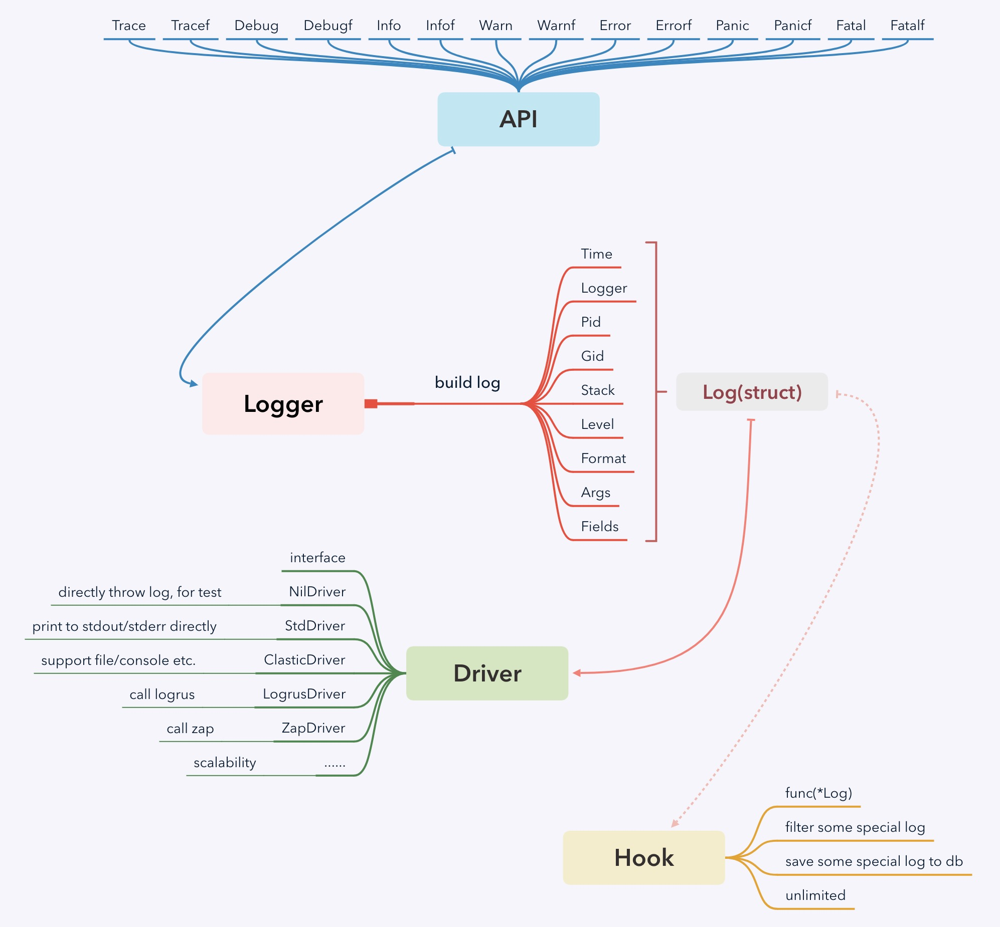

# Slf4go [](https://travis-ci.org/go-eden/slf4go)

Simple logger facade for Golang, inspired by `slf4j`, which forced on performance and scalability.

# Introduction

Before introducing this library, let's walk through the composition of logging library.

1. Provide log api, like `Trade` `Debug` `Info` `Warn` `Error` etc.
2. Collect log information, like log's time, stacktrace, and other context fields. 
3. Format and print log, or store it directly.

For most logging library, `1` and `2` is quite similar, but different libraries may use different logging libraries, this could lead to chaos.

In the java language, most libraries use `slf4j` as its logging facade,
you can decide to use `logback` or `log4j` etc as real logging implementation, and switch it easily.   

I believe there should have similar "facade" in golang, and i hope this library could be golang's `slf4j`.

`slf4go` forced on `1` and `2`, it collect all information to build `Log` instance, and finally passed to `Driver`.

What need special explanation is, `slf4go` has very high performance, for more details, check `Performance` section. 

# Components

`slf4go` have several components:

+ `log`: Log record's structure, contains `Time`, `Logger`, `Pid`, `Gid`, `Stack`, `Fields`, etc.
+ `logger`: Provide api for `Trace`, `Debug`, `Info`, `Warn`, `Error`, `Panic`, `Fatal`.
+ `driver`: It's an interface, used for decoupling `Api` and `Implementation`.
+ `hook`: Provide a hook feature, can be used for log's async hook.

For better understanding, check this chart:



# Features

TODO

# Install

Could use this command to install `slf4go`:

```bash
go get github.com/go-eden/slf4go
```

Could import `slf4go` like this:

```go
import (
	log "github.com/go-eden/slf4go"
)
```

# Usage

`Slf4go` provided a global default logger by default, in most case, you can use it directly, don't need any other operation.

```go
package main

import (
	log "github.com/go-eden/slf4go"
	"time"
)

func main() {
	log.Debugf("debug time: %v", time.Now())
	log.Warn("warn log")
	log.Error("error log")
	log.Panicf("panic time: %v", time.Now())
}
``` 

Result is this:

```
2019-06-16 19:35:05.167 [0] [TRACE] [main] default_example.go:12 debug time: 2019-06-16 19:35:05.167783 +0800 CST m=+0.000355435
2019-06-16 19:35:05.168 [0] [ WARN] [main] default_example.go:15 warn log
2019-06-16 19:35:05.168 [0] [ERROR] [main] default_example.go:17 error log
2019-06-16 19:35:05.168 [0] [PANIC] [main] default_example.go:20 panic time: 2019-06-16 19:35:05.168064 +0800 CST m=+0.000636402
goroutine 1 [running]:
runtime/debug.Stack(0x10aab40, 0xc0000b4100, 0x1)
	/usr/local/Cellar/go/1.12.6/libexec/src/runtime/debug/stack.go:24 +0x9d
github.com/go-eden/slf4go.Panicf(0x10cfd89, 0xe, 0xc0000b40f0, 0x1, 0x1)
	/Users/sulin/workspace/go-eden/slf4go/slf_core.go:191 +0x80
main.main()
	/Users/sulin/workspace/go-eden/slf4go/example/default_example.go:20 +0x213
```

Notice: `panic` and `fatal` will print `goroutine` stack automatically.

You cal also create your own logger for other purposes:

```go
log1 := log.GetLogger()
log1.Info("hello")
log2 := log.NewLogger("anyname")
log2.Info("world")
```

# Custom Driver

TODO

## Introduce `Log`

`Logger` will collect all required infomation into `Log` instance, `Driver` should print or store it as need.

The structure is like:

```go
type Log struct {
	Time   int64  `json:"date"`   // log's time(us)
	Logger string `json:"logger"` // log's name, default is package

	Pid        int     `json:"pid"`         // the process id which generated this log
	Gid        int     `json:"gid"`         // the goroutine id which generated this log
	Stack      *Stack  `json:"stack"`       // the stack info of this log
	DebugStack *string `json:"debug_stack"` // the debug stack of this log

	Level  Level         `json:"level"`  // log's level
	Format *string       `json:"format"` // log's format
	Args   []interface{} `json:"args"`   // log's format args
	Fields Fields        `json:"fields"` // additional custom fields
}
``` 

## Default StdDriver

By default, `Slf4go` provide a `StdDriver` as fallback, it will format `Log` and print it into `stdout` directly.

If you don't need other features, could use it directly.

## Use `slf4go-classic`

TODO

## Use `logrus`

TODO

## Provide your own driver

TODO

# Custom Hook

TODO

# Performance

TODO

# Benefit

As we can see, golang changes very quickly, and the logger-tech isn't very mature.

Separate the logger implement from modules maybe a good idea.

if oneday you need to use `logxxx` replace `logrus`, 
do you want to change all code contains `log.info(...)`?
   
or only change `logger_init.go`?